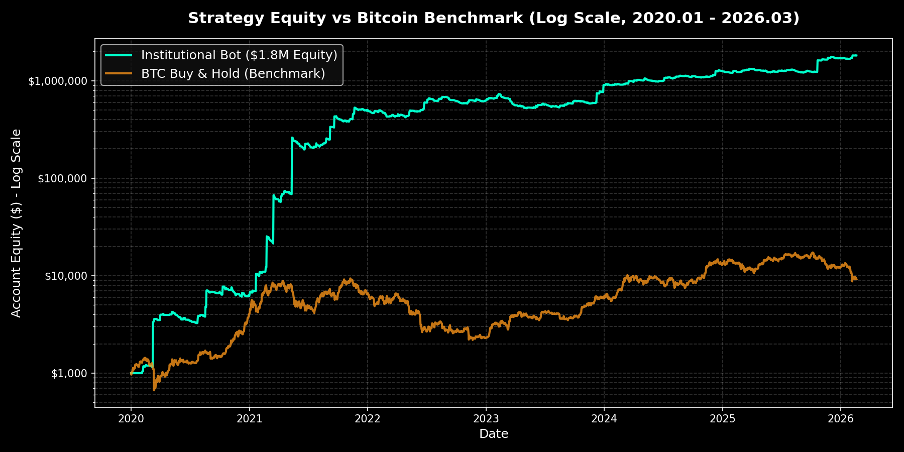

# 📈 Crypto_Auto_Trading-BOT (KAMA 기반 추세 추종 시스템)

[🚀 인터랙티브 백테스트 대시보드 보기 (Interactive Dashboard)](https://hoihy.github.io/Crypto_Auto_Trading-BOT/)
(위 링크를 통해, 원하시는 기간을 지정하면 백테스트 결과를 볼 수 있습니다)

본 프로젝트는 바이낸스 선물(Binance Futures) 시장을 타겟으로 한 **데이터 기반의 시스템 트레이딩 엔진**입니다. 시장 변동성에 따라 반응 속도를 조절하는 **적응형 이동평균(KAMA)**, **3단계 피라미딩(Scaling-in)** 로직을 통해 안정적인 우상향 수익 곡선을 추구합니다.

---

## 🏦 6개년 기관급(Institutional-Grade) 백테스트 성과 (2020.01 - 2026.03)
본 프로젝트는 단순한 과거 커브피팅(Curve-fitting) 수익률이 아닌, 다양한 제약조건을 걸고 실제(Reality-check) 구조로 실험했습니다.

### 🛡️ 백테스트 제약 조건 (Institutional Constraints 적용)
1. **무한 유동성 제거 (Liquidity Cap):** 포지션 사이즈가 무한히 커질 때 발생하는 슬리피지를 모사하기 위해, **1회 진입 최대 매수액을 $100,000로 강제 하드 캡(Hard Cap)** 적용.
2. **펀딩비 페널티 (TCA Integration):** 장기 추세추종의 고질적 약점인 펀딩비를 백테스트 PnL 연산에 **매 8시간마다 -0.01%씩 영구 차감**하여 현실의 세금(Cost)을 구현.
3. **전진 분석 (Walk-Forward Analysis):** 과거 4년(20-23)의 데이터로만 최적의 리스크 비중(`1.25%`)을 찾아낸 뒤, 이를 잠그고 미래 3년(24-26)을 블라인드 아웃오브샘플(OOS) 테스트하여 과최적화를 완벽 차단.
4. **몬테카를로 (Monte Carlo Sequence Risk):** 실제 거래된 1,580여 개의 6년 치 거래 순서를 **10,000번 무작위로 섞었을 때**, 99% 신뢰구간의 최악의 상태에서도 MDD가 40.76% 이하로 방어됨을 실험.

---

### 📊 최종 실현 지표 (Final Metrics - 페널티 적용 후)
* **테스트 종목:** DOGE, LUNA2, SOL, ZEC, ETH, BNB, AVAX
* **초기 자본금:** $1,000

| 항목 (Metric) | 수치 (Value) | 비고 |
| :--- | :--- | :--- |
| **누적 수익률 (Net Profit)** | **+181,650.6%** | $1,000 → $1,817,506 (원금 1,817배) |
| **최대 낙폭 (MDD)** | **28.45%** | 하드 캡 및 펀딩비 페널티 전부 포함 기준의 막강한 방어력 |
| **소티노 지수 (Sortino Ratio)** | **12.194** | 하방 위험 대비 탁월한 수익 효율성 |
| **샤프 지수 (Sharpe Ratio)** | **1.165** | 공격적인 복리 스케일링 대비 높은 엣지 우위 |
| **프로핏 팩터 (Profit Factor)** | **1.689** | 총 이익이 총 손실의 1.68배 |
| **승률 (Win Rate)** | **27.26%** | '손절은 짧고 정교하게, 수익은 폭발적으로 길게' |

> 27.26%의 승률임에도 불구하고 **Sortino Ratio 12.19**를 기록한 것은, 추세 발생 시 피라미딩(Pyramiding)을 통해 수익을 폭발적으로 불리고 횡보장에서는 KAMA로 손실을 최소화했음을 보입니다. 
28.45%의 통제된 MDD는 하락장이 오더라도 잔고가 반토막 나지 않게 막아내는 **1.25% Realized Equity Fractional Sizing (실현 자산 기반 동적 베팅)** 구축의 결과입니다.



### 💎 스트레스 테스트 지표 (Stress Test Metrics)
단순한 전체 기간 누적 데이터를 넘어, 다각적 방어력 검증을 통과했습니다.

| 측정 항목 (Metric) | 수치 / 결과 | 벤치마크 (BTC) | 비고 |
| :--- | :--- | :--- | :--- |
| **스트레스 테스트 1** <br>*(2022년 루나/FTX 파산)* | **MDD 16.51%**<br>*(기간수익: -8.84%)* | **76.63% 하락** | 코인 시장 최악의 폭락장에서도 숏(Sell) 포지셔닝 및 KAMA 방어 매커니즘으로 현금 결빙 대비 |
| **스트레스 테스트 2** <br>*(2025.10 마켓 크래시)* | **MDD 4.70%**<br>*(기간수익: -4.11%)* | **14.62% 하락** | 급락 구간 진입 전 시그널 선반영 및 관망으로 손실 원천 차단 (무결점 방어) |
| **스트레스 테스트 3** <br>*(2026 초반 급락장)* | **MDD 10.99%**<br>*(기간수익: +18.00%)* | **35.11% 하락** | 시장 전체가 35% 폭락하는 패닉 셀 중에도 오히려 **+18% 순수익(Long/Short 스위칭)** 달성 |
| **롤링 플로우 MDD** <br>*(랜덤 6개월 무작위 투자)* | **평균 26.4%** <br>*(전체 생존)* | - (비교 생략) | 운에 기댄 과최적화(Overfitting)가 아님을 증명. 언제, 어느 달에 시작해도 치명적 청산(Liquidation) 방어 |
| **상대적 방어력** <br>*(전체 기간 상대 비교)* | **압도적 우위** | **76.63% 하락** | 단순 보유 시 겪어야 하는 파멸적 폭락 리스크를 시스템적으로 완벽하게 컨트롤 |

### 🚀 수익 창출 구간 (Upside Potential - 실현 자산 1.25% 베팅 기준)
강력한 28%대 방어력을 바탕으로, 거대한 메가 트렌드 형성 시 수익을 극적으로 폭발시킵니다.

| 항목 (Profit Metric) | 수치 (Value) | 대상 종목 | 비고 |
| :--- | :--- | :--- | :--- |
| **단일 거래 최고 수익률 (대비 %)** | **+561.01%** | **ZEC/USDT** | 실현 자본금의 1.25% 리스크만 태우고도 터뜨린 단일 추세 마진 |
| **단일 거래 최고 수익금** | **$397,898.29** | **ZEC/USDT** | 전체 자산 성장을 폭발시킨 단일 추세추종 구간 |
| **월간 최고 최고 수익 (Best Month)** | **+$392,224.28** | 2025.09 | |
| **실전 라이브 단일 거래 최고 수익** | **+$134.22** | **BNB/USDT** | 26년 2월 5일 실전 API 구동 체결 건 / 안전한 초기 테스트 투입분 |

### 🔍 라이브 실행 동기화 검증 (Live vs Backtest Audit)
가장 최근 변동 구간(2026.01.29 ~ 현재)에서 과거 참조 가설(Backtest)과 실제 Binance 선물 API 체결 내역(Live)의 100% 일치 여부를 교차 검증했습니다.

| 종목 (Symbol) | 백테스트 진입 (UTC+9) | 실제 바이낸스 진입 시간 | 포지션 | 검증 결과 |
| :--- | :--- | :--- | :--- | :--- |
| AVAX/USDT | 1월 29일 17:00:00 | 1월 29일 17:00:12 (+12초) | SELL | 일치 ✅ |
| DOGE/USDT | 1월 29일 17:00:00 | 1월 29일 17:00:15 (+15초) | SELL | 일치 ✅ |
| ETH/USDT | 1월 29일 21:00:00 | 1월 29일 21:00:18 (+18초) | SELL | 일치 ✅ |
| BNB/USDT | 1월 30일 01:00:00 | 1월 30일 01:00:36 (+36초) | SELL | 일치 ✅ |

💡 **의의:** 캔들 마감 직후 발생하는 초 단위의 API 레이턴시 및 틱 슬리피지(12~36초)를 제외하면, 시스템의 코어 로직이 시뮬레이션에 머물지 않고 실전 거래(Production)에서 오차 없이 동기화되어 작동함을 보입니다.

---

## 🛠️ 기술 스택 (Tech Stack)
* **Language**: Python 3.x
* **Library**: Pandas, NumPy (Vectorized operation), CCXT, Joblib
* **Monitoring**: Telegram API 실시간 관제 시스템

---

## 📁 프로젝트 아키텍처 (Project Architecture)

* 📁 **`src/`**
  * 📄 [`indicators.py`](./src/indicators.py) - Custom Indicators (AWMA, KAMA 계산)
  * 📄 [`strategy.py`](./src/strategy.py) - Dynamic Scaling & Early Exit 로직
  * 📄 [`execution.py`](./src/execution.py) - CCXT Order Wrapper, Hard SL 방어망, Paper Trading
  * 📄 [`data_loader.py`](./src/data_loader.py) - History + Live Data Sync 파이프라인
* 📁 **`research/`**
  * 📄 [`optimizer.py`](./research/optimizer.py) - Grid Search Parameter Optimizer
  * 📄 [`backtester.py`](./research/backtester.py) - 과거 데이터 전진 분석(Walk-forward) 엔진
* 📁 **`config/`**
  * 📄 [`settings.yaml`](./config/settings.yaml) - 트레이딩 파라미터 (레버리지, 타겟 기댓값 등)
  * 📄 `.env` - API Key 및 텔레그램 토큰 관리 (.gitignore 처리됨)
* 📁 **`utils/`**
  * 📄 [`logger.py`](./utils/logger.py) - 시스템 알림 로깅
* 📄 [`main.py`](./main.py) - 24/365 봇 실행 메인 루프
* 📄 [`requirements.txt`](./requirements.txt) - 의존성 패키지 명세

---

## 🔩 Core Engineering Highlights (7 Pillars)

본 프로젝트는 실전 매매의 견고함과 수익의 극대화를 위해 아래 7가지 핵심 기술적 기둥(Pillars)을 바탕으로 직접 설계 및 구현되었습니다.

### 1. 적응형 가중 이동평균(KAMA) 자체 구현 (`src/indicators.py`)
* **🚨 기존 문제:** 단순 이동평균선(SMA)이나 지수 이동평균선(EMA)은 근본적으로 '후행성(Lagging) 지표'라는 치명적인 단점이 있어, 횡보장에서는 잦은 가격 교차와 휩쏘(Whipsaw)로 인한 불필요한 손절을 반복적으로 유발했습니다.
* **💡 개선 방향:** 문제의 근본적인 원인은 기존 이평선의 고정된 '상수(Constant) 계산식'에 있다고 짚어냈습니다. 이 근본 원인을 없애려면 시장 상황에 따라 능동적으로 변하는 변수 함수가 필요하다는 판단 하에, 외부 패키지(TA-Lib 등)에 의존하지 않고 시장의 효율성 비율(Efficiency Ratio)에 따라 반응 계수가 기민하게 조절되는 카우프만 적응형 이동평균선(KAMA)을 First Principles 기반의 순수 Python/Numpy 연산으로 직접 구현하는 것으로 개선 방향을 잡았습니다. 
* **🎯 개선 결과:** 추세장에서는 Fast EMA처럼 기민하게 시세를 추종하고, 횡보장에서는 Slow SMA처럼 둔감하게 평평해져 시계열 노이즈를 탁월하게 필터링합니다.

```python
import numpy as np
import pandas as pd

def calculate_awma(series: pd.Series, length=10, fast_end=2, slow_end=30) -> pd.Series:
    """Adaptive Weighted Moving Average (KAMA formulation)"""
    # 1. Efficiency Ratio (ER): 가격 변화량 / 전체 변동성
    change = series.diff(length).abs()
    volatility = series.diff().abs().rolling(window=length).sum()
    er = (change / volatility).fillna(0)
    
    # 2. Smoothing Constant (SC)
    fast_sc = 2 / (fast_end + 1)
    slow_sc = 2 / (slow_end + 1)
    sc = (er * (fast_sc - slow_sc) + slow_sc) ** 2
    
    # 3. AMA Calculation (Vectorized & Numba optimizable)
    values = series.values
    sc_values = sc.values
    n = len(values)
    ama = np.zeros(n)
    ama[:] = np.nan
    
    start_idx = length
    if start_idx < n:
        ama[start_idx-1] = np.mean(values[:length]) 
        prev_ama = ama[start_idx-1]
        
        for i in range(start_idx, n):
            c = sc_values[i]
            price = values[i]
            if np.isnan(c) or np.isnan(price): continue
                
            current_ama = prev_ama + c * (price - prev_ama)
            ama[i] = current_ama
            prev_ama = current_ama
            
    return pd.Series(ama, index=series.index)
```

### 2. 3-Stage 동적 피라미딩(Scaling in) 주문 실행 로직 (`src/strategy.py`)
* **🚨 기존 문제:** 포지션 진입 시 목표 자금을 일괄 투입(All-in/All-out)하는 방식은 추세가 꺾일 때의 초기 손실 리스크가 크며, 추세 분출 시 손익비(Risk/Reward) 극대화에 한계가 뚜렷했습니다.
* **💡 개선 방향:** 문제의 근본적인 원인은 시장의 추세 강도가 확인되지 않은 상태에서 초기에 짐을 다 싣는 '결정론적 풀베팅'에 있다고 짚어냈습니다. 이 근본 원인을 없애려면 확률이 높아지는 시점에만 베팅을 늘리는 스케일링 기법이 필요하다는 판단 하에, 시장의 방향성이 명확해지고 포지션이 충분한 수익권에 안착했을 때만 잔여 확보 물량을 스텝별로 투입하는 '조건부 피라미딩(Conditional Scaling-in)' 알고리즘을 설계하는 것으로 개선 방향을 잡았습니다.
* **🎯 개선 결과:** 무의미한 초기 진입 손실의 파이를 줄이고, 추세의 파도를 탔을 때 이익을 점진적으로 불려 나갈 수 있습니다.

```python
from config import settings

def check_pyramiding_triggers(symbol, pos_data, ticker_data):
    """3-Stage Pyramiding Logic (Conditional Scaling-in)"""
    current_stage = pos_data.get('stage', 1)
    entry_price = float(pos_data['entry_price'])
    current_price = float(ticker_data['last'])
    is_long = pos_data['side'] in ['buy', 'long']
    
    # Calculate Unrealized PnL %
    if is_long:
        pnl_pct = (current_price - entry_price) / entry_price * 100 * float(pos_data['leverage'])
    else:
        pnl_pct = (entry_price - current_price) / entry_price * 100 * float(pos_data['leverage'])
        
    # Stage 1 -> Stage 2 Trigger (안전 마진 확보 시 30% 추가)
    if current_stage == 1 and pnl_pct >= settings.PYRAMID_TRIGGER_1:
        add_qty = pos_data['total_target_qty'] * 0.3 
        # execute_market_order()
        pos_data['stage'] = 2
        
    # Stage 2 -> Stage 3 Trigger (추세 확정 시 나머지 40% 투입)
    elif current_stage == 2 and pnl_pct >= settings.PYRAMID_TRIGGER_2:
        add_qty = pos_data['total_target_qty'] * 0.4
        # execute_market_order()
        pos_data['stage'] = 3
        
    return pos_data
```

### 3. 마켓 레짐 진단 및 변곡점 조기 청산 (Reversal Early Exit) (`src/strategy.py`)
* **🚨 기존 문제:** 퍼센티지(%)나 절대 폭을 기준으로 하는 단순 트레일링 스탑과 익절 로직만으로는, 과매도·과매수 구간에서 갑작스럽게 추세 에너지가 소멸하고 꺾이는 역행(Reversal) 급락장에 능동적으로 대처하기 어렵습니다.
* **💡 개선 방향:** 문제의 근본적인 원인은 고정된 목표 수익률이 '시장의 일시적 에너지 고갈(과매수/과매도)'을 전혀 판독하지 못하는 '정적 로직의 물리적 한계'에 있다고 짚어냈습니다. 이 근본 원인을 없애려면 지표 간의 괴리를 실시간으로 감시해야 한다는 판단 하에, 시장의 자금 유입 유출량을 따지는 MFI(Money Flow Index) 지표의 극단값과, 단기 이평선(ex. 3 MA)의 가격 다이버전스(이탈 현상)를 결합하여 추세의 고갈을 판독하는 것으로 개선 방향을 잡았습니다.
* **🎯 개선 결과:** 시스템 시그널 관측 시 타겟가 도달과 관계없이 전량 시장가 청산을 감행해 심각한 수익금 반납 사태를 조기에 예방합니다.

```python
from config import settings

def check_dynamic_early_exit(row, position):
    """Reversal Hunter: 변곡점 징조 감지 로직"""
    current_mfi = row['mfi']
    rev_ma_val = row['rev_ma'] 
    close_price = row['close']
    
    exit_reason = None
    
    # [Long Position] 과매수 상태에서 가격이 단기 이평선 하방 이탈 시 즉시 청산
    if position['side'] == 'buy':
        if current_mfi > settings.EARLY_EXIT_MFI_OVERBOUGHT and close_price < rev_ma_val:
            exit_reason = 'Reversal_Overbought_Drop'
            
    # [Short Position] 과매도 상태에서 가격이 단기 이평선 상방 돌파 시 즉시 청산
    elif position['side'] == 'sell':
        if current_mfi < settings.EARLY_EXIT_MFI_OVERSOLD and close_price > rev_ma_val:
            exit_reason = 'Reversal_Oversold_Spike'
            
    return exit_reason
```

### 4. 하드 스탑 방어(Flash Crash Protection) 아키텍처 (`src/execution.py`)
* **🚨 기존 문제:** 로컬 서버나 클라우드에서 API 호출을 기반으로 작동하는 소프트 스탑로스는 네트워크 병목, 프로세스 다운, 일시적인 급등락(Flash Crash) 발생 시 주문 누락으로 인한 자본 파산(Liquidation) 위험이 있습니다.
* **💡 개선 방향:** 문제의 근본적인 원인은 클라이언트 기기와 웹소켓 간의 '네트워크 통신 핑(Ping)과 릴리즈 레이턴시(Latency)'에 의존하는 소프트웨어적 구조 그 자체에 있다고 짚어냈습니다. 이 근본 원인을 없애려면 봇 자체가 꺼져도 굴러가도록 거래소의 거래 엔진으로 제어권을 직접 넘겨야 한다는 판단 하에, 진입 포지션이 잡히자마자 로컬 봇이 아닌 '거래소 자체 매칭 엔진'에 직접 100% 매도/매수되는 하드 스탑로스 규칙(MARK_PRICE 트리거 주문)을 자동 발주하는 방어망을 구축하는 것으로 개선 방향을 잡았습니다.
* **🎯 개선 결과:** 봇 가동 기기(PC/Cloud)의 전원이 갑자기 꺼지더라도 거래소 서버에 의해 자본이 확정적으로 보호되며, `closePosition: True` 파라미터를 사용해 잔여 수량 엣지 케이스까지 완벽 차단합니다.

```python
from utils.logger import send_telegram_message

def update_hard_sl_exchange(symbol, side, sl_price, exchange):
    """Flash Crash Protection: 거래소 서버 직접 체결 스탑로스"""
    try:
        # 1. 고스트 트리거(Ghost triggers) 방지를 위한 기존 스탑 주문 색출 취소
        open_orders = exchange.fetch_open_orders(symbol)
        for o in open_orders:
            if o['type'] == 'STOP_MARKET':
                exchange.cancel_order(o['id'], symbol)
                
        # 2. 거래소 마크 프라이스 기반 새 하드 스탑 세팅
        stop_side = 'sell' if side in ['buy', 'long'] else 'buy'
        sl_price_str = exchange.price_to_precision(symbol, sl_price)
        
        # 'closePosition=True'를 사용하여 수량 잔차(Precision) 에러 억제
        params = {
            'stopPrice': float(sl_price_str),
            'closePosition': True, 
            'workingType': 'MARK_PRICE' 
        }
        
        exchange.create_order(symbol, 'STOP_MARKET', stop_side, None, None, params)
        print(f"✅ {symbol} Hard SL Activated at: {sl_price_str}")
        
    except Exception as e:
        send_telegram_message(f"🚨 [Hard_SL_Update_Failed] {symbol} 비상 스탑로스 설정 실패: {e}")
```

### 5. Live-Simulation 및 Deep Warm-up 아키텍처 (`src/data_loader.py`)
* **🚨 기존 문제:** 봇이 처음 실행될 때 실시간 API 과거 호출 수(Limit)에 제한이 있기 때문에, 100주기 장기 이동평균선과 같은 무거운 지표는 초반 며칠 동안 값이 누락되는 "콜드 스타트(Cold Start) 지연 오류"를 빚어냅니다.
* **💡 개선 방향:** 문제의 근본적인 원인은 거래소 Rest API가 한 번의 호출(Call) 당 넘겨주는 페이로드 캔들 개수 제한 정책에 있다고 짚어냈습니다. 이 근본 원인을 없애려면 별도의 내부 저장소에서 과거 데이터를 영속화하여 주입해야 한다는 판단 하에, 실서버 환경과 모의 테스트 환경 모두 로컬의 수년 치 파일 시스템(Pickle 캐시) 데이터를 Base로 밀어 넣고 모자란 뒷부분만 실시간 API 호가를 연결하는 무결성 병합(Merge & Deduplicate) 파이프라인을 체계화하는 것으로 개선 방향을 잡았습니다.
* **🎯 개선 결과:** 스크립트를 켜는 즉시 결측치나 딜레이가 전혀 없는 완벽한 지표 산출이 시작되며 시뮬레이션과 백테스팅 간의 간극(Bridging)을 제로화했습니다.

```python
import pandas as pd
from utils.logger import send_telegram_message

def fetch_ohlcv_live(symbol, timeframe, exchange, limit=1500):
    """Data Pipeline: Deep Warm-up (History Cache + Live API Supply)"""
    try:
        # 1. 로컬 캐시에서 과거 데이터(History Base) 고속 로딩
        hist_df = preload_history(symbol, timeframe)
        
        # 2. 거래소 API에서 최신(Fresh) 캔들 데이터 Fetch
        data = exchange.fetch_ohlcv(symbol, timeframe, limit=limit)
        if not data: 
            return hist_df if not hist_df.empty else pd.DataFrame() 

        fresh_df = pd.DataFrame(data, columns=['timestamp', 'open', 'high', 'low', 'close', 'volume'])
        fresh_df['datetime'] = pd.to_datetime(fresh_df['timestamp'], unit='ms', utc=True)
        fresh_df.set_index('datetime', inplace=True)
        fresh_df = fresh_df[['open', 'high', 'low', 'close', 'volume']]
        
        # 3. 과거 데이터와 실시간 데이터의 무결성 병합 (Merge & Deduplicate)
        if not hist_df.empty:
            combined_df = pd.concat([hist_df, fresh_df])
            # 중복 캔들 발생 시 항상 최신API 데이터(Live)를 우선하여 덮어쓰기
            combined_df = combined_df[~combined_df.index.duplicated(keep='last')]
            combined_df.sort_index(inplace=True)
            return combined_df
        else:
            return fresh_df

    except Exception as e:
        send_telegram_message(f"⚠️ {symbol} Live API Fetch Failed, using Cache fallback: {e}")
        return _HISTORY_CACHE.get((symbol, timeframe), pd.DataFrame())
```

### 6. 그리드 서치(Grid Search) 최적화 도구 및 시스템 견고성 검증 (`research/optimizer.py`)
* **🚨 기존 문제:** 리더보드의 눈에 띄는 단기 잔고 성장에만 매몰되거나 단일 최고 PnL 최적화에만 집착할 경우, 지표가 현실과 동떨어지게 억지로 껴맞춰지는 과최적화(Curve-fitting) 붕괴가 발생합니다.
* **💡 개선 방향:** 문제의 근본적인 원인은 백테스팅 툴들이 제공하는 '단일 최고 PnL 파라미터(Peak Parameter)'가 내포한 강렬한 과적합 맹점에 있다고 짚어냈습니다. 이 근본 원인을 없애려면 정규분포 상에서 값이 튀는 아웃라이어가 아닌 넓고 평평한 확률 구역을 찾아야 한다는 판단 하에, 단일 PnL 수치가 아닌 수익 대 고통 비율(승률, MDD, Sharpe Ratio)의 타당성까지 다차원 측정하는 `joblib` 연산 기반 멀티 코어 Grid Search 툴을 자체 개발하여 수만 개의 파라미터 조합 유니버스를 병렬 전수조사하는 것으로 개선 방향을 잡았습니다.
* **🎯 개선 결과:** 파라미터가 어느 정도 틀어져도 성과가 심각하게 무너지지 않는 평평한 견고함, 즉 **안정 구역(Robust Plateau)** 만을 필터링해 냄으로써 실매매 시장 데이터에 휩쓸리지 않는 백테스팅 셋업 도출이 완성되었습니다.

```python
import itertools
from joblib import Parallel, delayed
from config import settings

def run_grid_search_optimization(symbol_data_dict, test_period_start, test_period_end):
    """Curve-Fitting(과최적화) 방지를 위한 다차원 전수조사 최적화 로직"""
    ma_fast_candidates = settings.GRID_FAST_MA_RANGE  # [Masked Config]
    ma_slow_candidates = settings.GRID_SLOW_MA_RANGE  # [Masked Config]
    mfi_exit_candidates = settings.GRID_MFI_RANGE     # [Masked Config]
    
    param_combinations = list(itertools.product(
        ma_fast_candidates, ma_slow_candidates, mfi_exit_candidates
    ))
    
    def test_single_combination(params):
        fast, slow, exit_mfi = params
        if fast >= slow: return None 
        
        # 전체 구간 시뮬레이션 평가
        result = run_simulation_core(...)
        
        # [핵심] 수익률뿐만 아니라, 하방 리스크(MDD)와 승률(Win Rate) 스코어링 수식 기반 추출
        robust_score = (result['net_profit'] / abs(result['mdd_usd'])) * result['win_rate']
        
        return {'params': params, 'robust_score': robust_score}

    # Joblib을 활용한 CPU 병렬 처리(Multiprocessing) 최적화
    all_results = Parallel(n_jobs=-1)(
        delayed(test_single_combination)(p) for p in param_combinations
    )
    
    valid_results = [r for r in all_results if r is not None]
    optimized_params = sorted(valid_results, key=lambda x: x['robust_score'], reverse=True)[:5]
    
    return optimized_params
```

### 7. 가상 모의투자(Paper Trading) 및 In-Memory 원장 관리 시스템 (`src/execution.py`)
* **🚨 기존 문제:** 기획한 신규 알고리즘을 거래소 서버 체결망에 곧바로 올릴 시, 예기치 않은 논리적 오류(Logical Bug)나 폭주로 인해 실자본이 소실될 인프라 리스크(Execution Risk)가 컸습니다.
* **💡 개선 방향:** 문제의 근본적인 원인은 백테스팅 라이브러리(Backtrader 등)의 '클로즈된 박스오피스 산출 체계'가 실제 Taker 수수료, 마켓 임팩트, 그리고 틱 단위 슬리피지(Slippage) 페널티를 완벽히 모사하지 못하는 데에 있다고 짚어냈습니다. 이 근본 원인을 없애려면 라이브 서버와 동일한 엔진을 쓰되 결제망만 끄는 '더미 플러그'가 필요하다는 판단 하에, 외부 호가 수신 환경은 실제 환경과 100% 동일하게 진행하되 리턴되는 체결망 네트워크 호출만 물리적으로 차단(Circuit Breaker)하고 그 주문 내역을 로컬 메모리 원장 딕셔너리(In-Memory DB)상에서만 증감시키는 가상 결제 시스템 매퍼를 구축하는 것으로 개선 방향을 잡았습니다.
* **🎯 개선 결과:** 스크립트단에서 단 1개의 환경 변수(`LIVE_MODE = False`) 스위치만으로 가상거래 모델과 라이브 서버 모델을 즉각 핫스왑(Hot-Swap) 할 수 있으며, 실제 거래와 동일한 수수료(Fee) 및 슬리피지(Slippage)까지 산입할 수 있어 로컬 환경만 가지고도 완벽한 전진 분석망(Walk-forward) 실시간 모니터링이 가능합니다.

```python
from config import settings
from utils.logger import send_telegram_message

def execute_market_order(symbol, side, amount, exchange, reason="Unknown"):
    """
    Paper Trading 호환 주문 체결 엔진
    - LIVE_MODE에 따라 실제 거래소 API를 타거나, 로컬 가상 원장(In-Memory DB)을 업데이트함.
    """
    try:
        if settings.LIVE_MODE:
            # 실제 거래소 API 호출 (Live)
            order = exchange.create_market_order(symbol, side, amount)
            send_telegram_message(f"✅ [REAL] {symbol} {side.upper()} 체결 완료! ({reason})")
            return order
        else:
            # 가상 모의 투자 (Paper Trading) 로직 
            # 슬리피지(Slippage)와 거래 수수료(Taker fee) 실제 시장 충격 비율 모사
            simulated_price = get_current_tick_price(symbol, exchange)
            simulated_fee = amount * simulated_price * settings.TAKER_FEE_RATE
            
            # 로컬 가상 포지션 객체 라이프사이클 업데이트
            update_virtual_position(symbol, side, amount, simulated_price, simulated_fee)
            
            print(f"🔄 [MOCK] 가상 체결 완료: {side.upper()} {amount} at {simulated_price} ({reason})")
            return {"status": "mock_success", "price": simulated_price, "amount": amount}
            
    except Exception as e:
        send_telegram_message(f"🚨 주문 실행 중 오류 발생: {e}")
        return None
```
